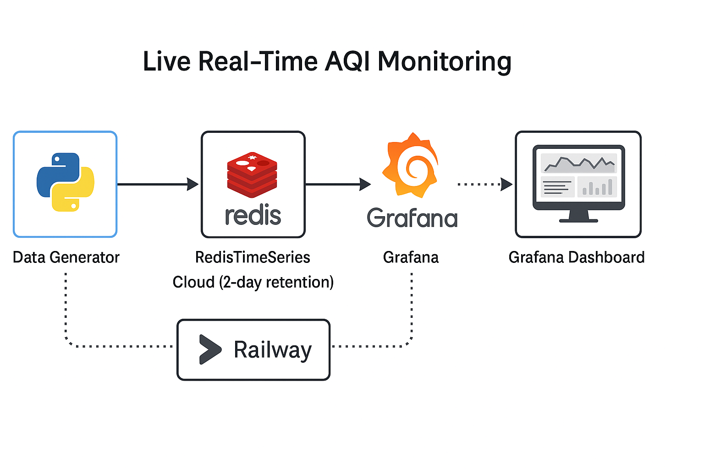

# Live Real-Time AQI Monitoring Dashboard

This project simulates real-time **Air Quality Index (AQI)** data generation for four different zones and visualizes the data using **Grafana** dashboards. Built with Python, RedisTimeSeries, Docker, and deployed via **Railway**, it showcases a complete real-time data pipeline.

---

## 📽️ Live Demo

🔗 **Grafana Dashboard**: [View Dashboard](https://yashhonrao2024.grafana.net/public-dashboards/78aec0ef856848239209fd5293506e7e)

🥠**Demo Video**: [


> I encourage you to check out this short demonstration — it gives a clearer visual of how real-time AQI data updates are streamed, stored, and displayed live on the Grafana dashboard.

---

## Tech Stack

| Layer            | Tech Used                          |
|------------------|------------------------------------|
| Data Generator   | Python, RedisTimeSeries            |
| Datastore        | Redis Cloud (Free tier)            |
| Containerization | Docker                             |
| Visualization    | Grafana Cloud                      |
| Deployment       | Railway (background worker)        |

---

## How It Works

1. A Python script simulates realistic AQI data for:
   - Downtown
   - Industrial Zone
   - Residential Area
   - Airport

2. Every 10 seconds, each zone pushes a new AQI value to Redis Cloud as a time-series key.

3. Each key has a **2-day retention policy**, auto-cleaning older entries.

4. Grafana connects to Redis and displays real-time graphs for each location using `TS.MRANGE` queries.

---

## Sample Output

[Downtown] -> AQI 83 @ 1747123348934

[Industrial Zone] -> AQI 139 @ 1747123349250

[Residential Area] -> AQI 62 @ 1747123349362

[Airport] -> AQI 77 @ 1747123349448


## Architecture Diagram




---

## 🛠️ Local Development

### 1. Clone and Set Environment Variables

```bash
git clone https://github.com/YOUR_USERNAME/Live-AQI.git
cd Live-AQI


Create a .env file:


REDIS_HOST=your-redis-host
REDIS_PORT=your-port
REDIS_PASSWORD=your-password


Run with Docker

docker build -t aqi-pusher .
docker run --env-file .env aqi-pusher


🌐 Deployment (Railway)

Push code to GitHub

Connect to Railway

Add your Redis credentials as environment variables

Railway runs the container 24/7 as a background worker


📁 Key Files
File	Description
generate_data.py	AQI data generator + Redis writer
Dockerfile	Container config
requirements.txt	Python dependencies
.env	(Ignored) Holds Redis credentials
railway.json	Railway deployment config


🧠 Lessons Learned
How to stream real-time sensor data to Redis

Time-series retention and data labeling

Using Grafana's TS.MRANGE and visualizing grouped labels

Docker + Railway deployment flow