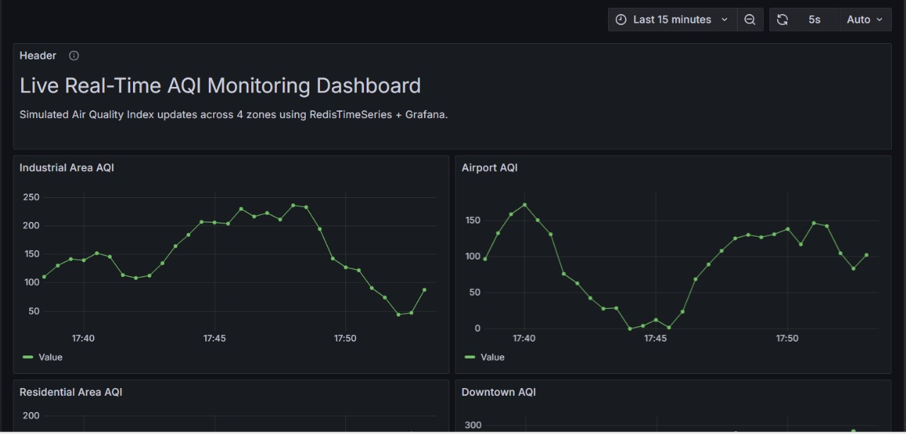

# 📊 Visualization Guide: Real-Time AQI Dashboard

## ✅ Visualization Tool: Grafana Cloud

I used **Grafana Cloud** to visualize real-time AQI data from 4 city zones stored in RedisTimeSeries.

---

## 📈 Dashboard Overview

The dashboard consists of 4 real-time panels:
- Downtown
- Industrial Zone
- Residential Area
- Airport

Each panel displays:
- AQI trend over time
- Live updates every 10 seconds

---

## 🔗 Public Dashboard Link (Fully Real-Time)

🌐 **[View Live Dashboard](https://yashhonrao2024.grafana.net/public-dashboards/78aec0ef856848239209fd5293506e7e)**

---

## 🧠 How It Works

1. A Python script ingests data into Redis every 10 seconds
2. Each location is stored as a time-series key with labels
3. Grafana queries the data using `TS.MRANGE` with label filters like `location="Downtown"`
4. Dashboard panels auto-refresh and group data by city

---

## 🖼️ Static Screenshot of Dashboard

For offline grading or quick reference, here's a snapshot of the live dashboard:

---

## 📁 Visualization Code

No separate visualization script is needed — I made the dashboard on Grafana by connecting Redis datasoure directly via the RedisTimeSeries plugin. Panels were configured through the Grafana UI.